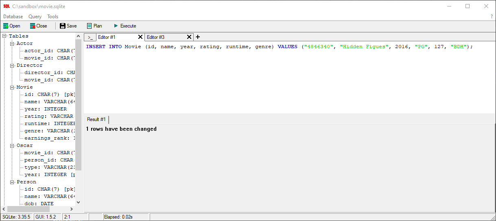
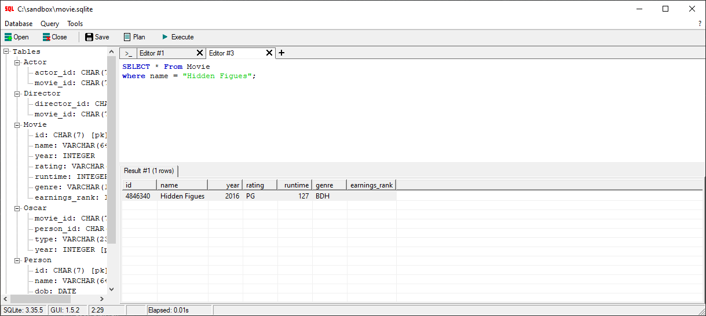
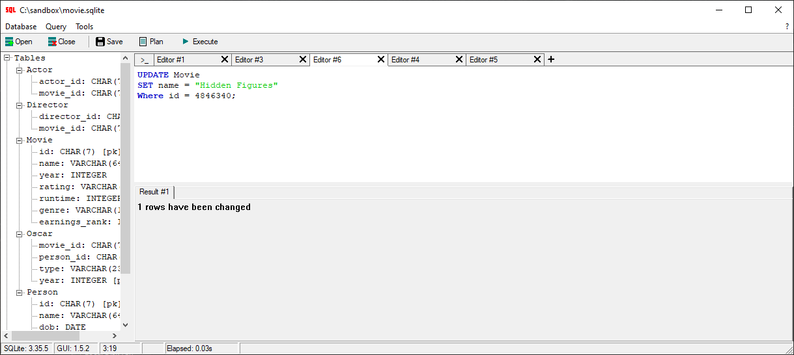
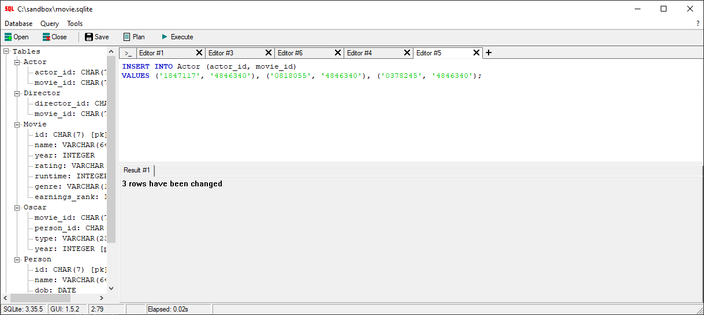
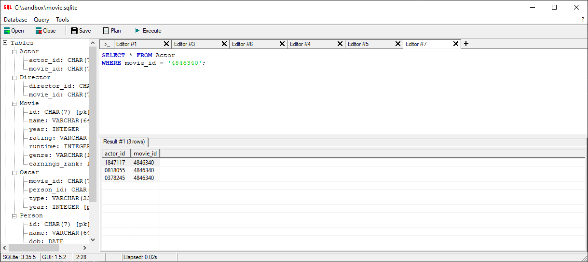

# week9_10
SQL SELECT queries 1

Problem 1

Insert Movie to Movie table

Double Check Movie is in the table

Whoops!!
Looks like I misspelled "Hidden Figures"
Lets update that.

Find the ID's for actors in the Movie so we can make connections

Insert the rows into the Actor Table

Double Check the Actors ID's are connected to the Movie ID

