# week9_10
SQL SELECT queries 1

## Problem 1

#### Insert Movie to Movie table
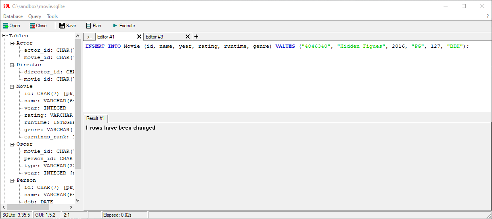

#### Double Check Movie is in the table

#### Whoops!!
#### Looks like I misspelled "Hidden Figures".
#### Lets update that.

#### Find the ID's for actors in the Movie so we can make connections
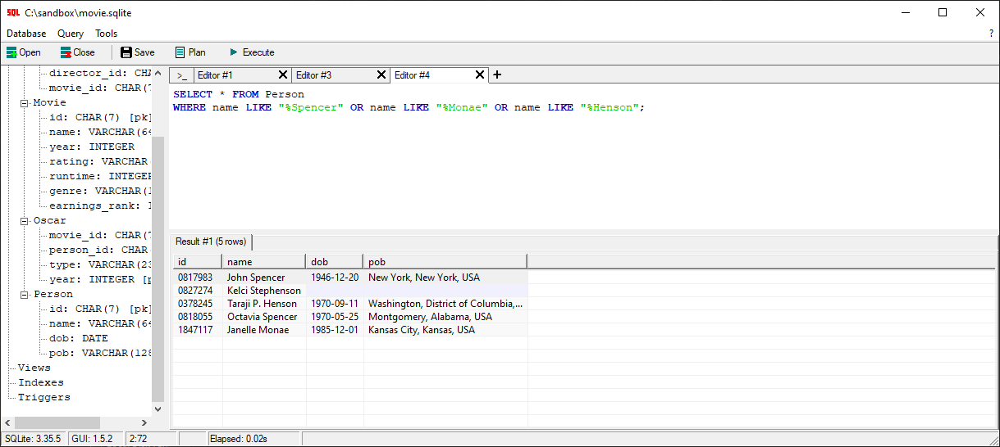

#### Insert the rows into the Actor Table

#### Double Check the Actors ID's are connected to the Movie ID
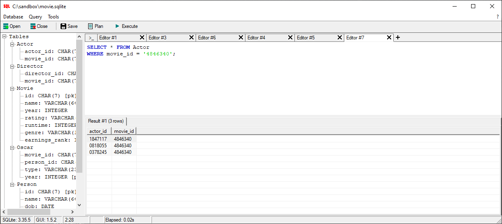

## Problem 2

#### Select three columns from a specific movie
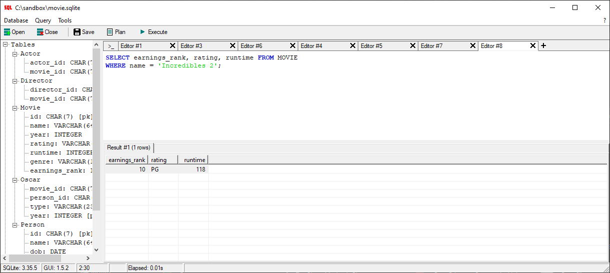

## Problem 3

#### Find the two nominees
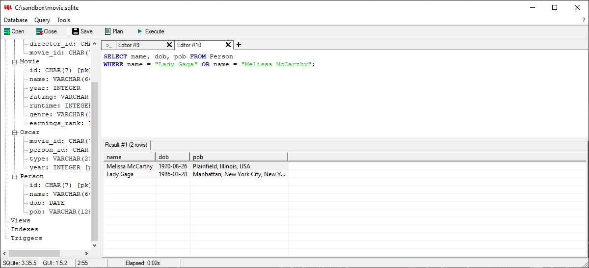

## Problem 4

#### Find the rated G movies released since 2010
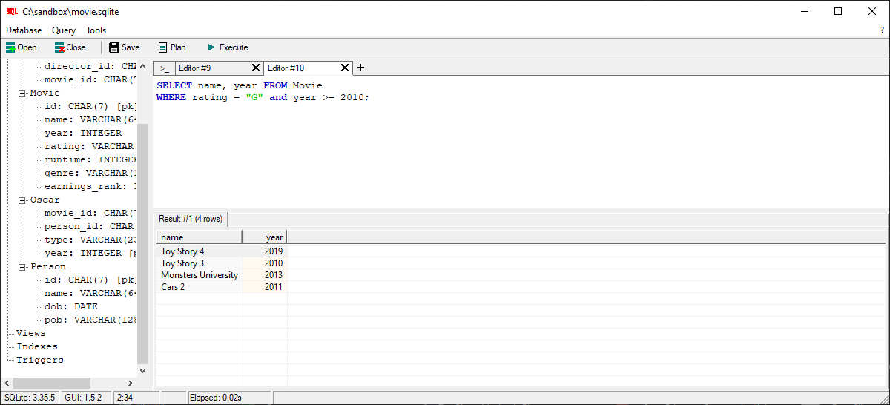

## Problem 5

#### Find the average earnings rank of top 200 grossing G rated movies
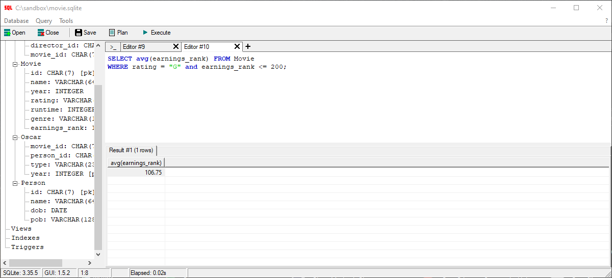

## Problem 6

#### Count the number of oscars for each year. But something isn't right...
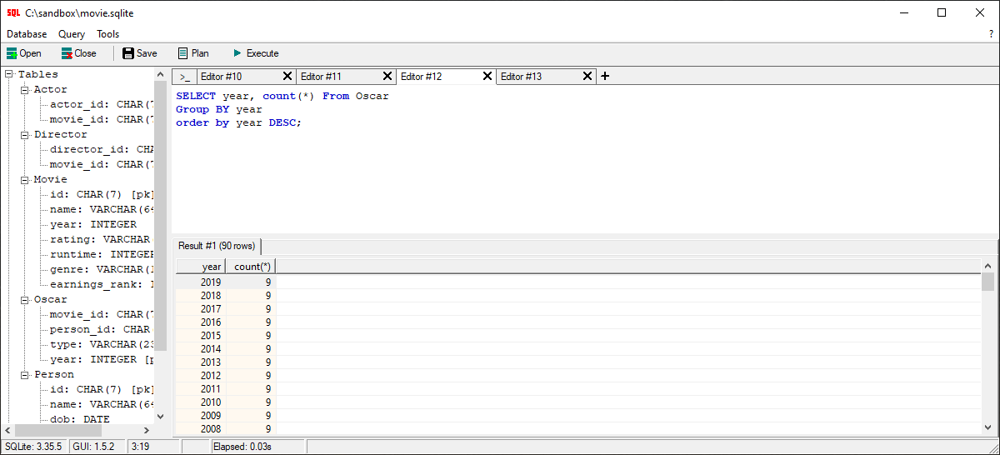

#### We seem to have some duplicates
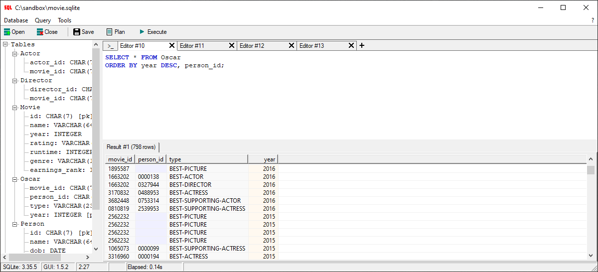

#### We can filter for distinct names in the "type" column
#### Appears we've always had 6 oscars except for the first 7 years which we only had 4
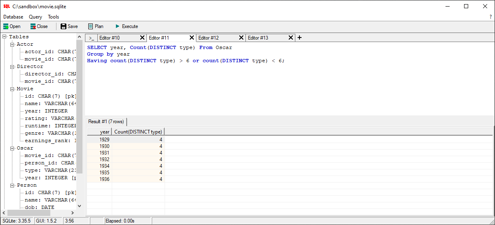

## Problem 7

#### The shortest Star Wars movie was the first one at 121 minutes
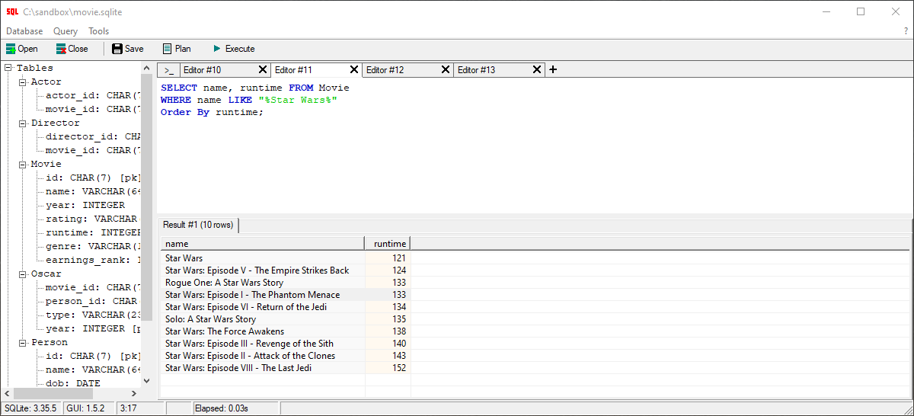
